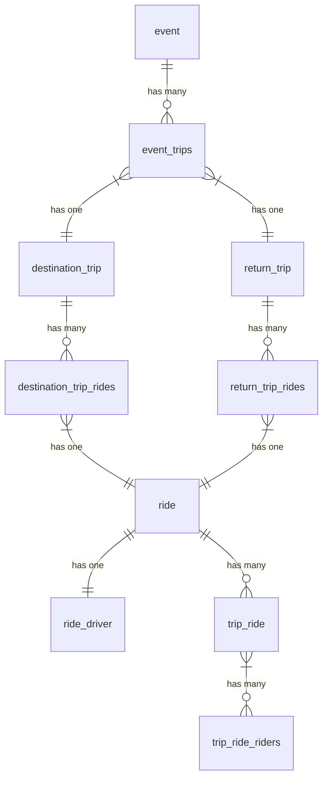

# Carpool Data Model Relationships

This document explains the relationships between the main Directus collections used for carpool coordination, as described in `carpool.plan.md`.

## Collections and Relationships

### 1. `event`

- **Description:** Represents an event that requires carpools (e.g., a competition or meeting).
- **Relationships:**
  - Has many `event_trips` (each event can have multiple associated trips).

### 2. `event_trips`

- **Description:** Associates trips with a specific event.
- **Relationships:**
  - Belongs to one `event` (via `event_id`).
  - Has one `destination_trip` (for the trip to the event).
  - Has one `return_trip` (for the trip back from the event).

### 3. `destination_trip`

- **Description:** Represents a trip to an event destination.
- **Relationships:**
  - Belongs to one `event_trips` (via `event_trips_id` or similar).
  - Has many `destination_trip_rides` (each trip can have multiple rides).

### 4. `destination_trip_rides`

- **Description:** Represents a ride associated with a destination trip.
- **Relationships:**
  - Belongs to one `destination_trip` (via `destination_trip_id`).
  - Has one `ride` (via `ride` field).

### 5. `return_trip`

- **Description:** Represents a trip returning from an event.
- **Relationships:**
  - Belongs to one `event_trips` (via `event_trips_id` or similar).
  - Has many `return_trip_rides` (each return trip can have multiple rides).

### 6. `return_trip_rides`

- **Description:** Represents a ride associated with a return trip.
- **Relationships:**
  - Belongs to one `return_trip` (via `return_trip_id`).
  - Has one `ride` (via `ride` field).

### 7. `ride`

- **Description:** Represents an individual ride, including driver, vehicle, and passenger details.
- **Relationships:**
  - Has one `ride_driver` (driver info).
  - Has many `trip_ride` (associations to trips).

### 8. `ride_driver`

- **Description:** Contains driver information for a ride.
- **Relationships:**
  - Belongs to one `ride` (via `ride_id`).

### 9. `trip_ride`

- **Description:** Associates a ride with a trip (either destination or return).
- **Relationships:**
  - Belongs to one `ride` (via `ride_id`).
  - Belongs to one `destination_trip` or `return_trip` (via `trip_id`).
  - Has many `trip_ride_riders` (passengers for this ride/trip association).

### 10. `trip_ride_riders`

- **Description:** Represents a passenger/rider for a specific trip ride.
- **Relationships:**
  - Belongs to one `trip_ride` (via `trip_ride_id`).

---

## Relationship Diagram

---

## Notes

- All relationships are based on the field names and intent described in `carpool.plan.md` and may need adjustment to match the actual Directus schema.
- For more details, see the schema snapshot and collection definitions in your project.
